Electric consumption Forecasting
================
Edgar KOUAJIEP
2022-09-06

# 1. Working environment and Data preparation

All the packages should be installed before loading them

``` r
listOfPackages <- c("readxl","xlsx","dplyr","ggplot2","fpp2","forecast","keras","vars")

for (i in listOfPackages){

     if(! i %in% installed.packages()){
       print(paste("Installing the package ",i, " ..."))
       install.packages(i, dependencies = TRUE)
       print(paste("Installation done"))
     }
     else {
       print(paste("The package ", i, " is already installed"))
     }

}
```

    ## [1] "The package  readxl  is already installed"
    ## [1] "The package  xlsx  is already installed"
    ## [1] "The package  dplyr  is already installed"
    ## [1] "The package  ggplot2  is already installed"
    ## [1] "The package  fpp2  is already installed"
    ## [1] "The package  forecast  is already installed"
    ## [1] "The package  keras  is already installed"
    ## [1] "The package  vars  is already installed"

Load all the necessary libraries.

``` r
rm(list = ls()) # clear the global environment 

library(readxl)
```

    ## Warning: le package 'readxl' a été compilé avec la version R 4.3.3

``` r
library(xlsx)
```

    ## Warning: le package 'xlsx' a été compilé avec la version R 4.3.3

``` r
library(dplyr)
```

    ## Warning: le package 'dplyr' a été compilé avec la version R 4.3.3

    ## 
    ## Attachement du package : 'dplyr'

    ## Les objets suivants sont masqués depuis 'package:stats':
    ## 
    ##     filter, lag

    ## Les objets suivants sont masqués depuis 'package:base':
    ## 
    ##     intersect, setdiff, setequal, union

``` r
library(ggplot2)
```

    ## Warning: le package 'ggplot2' a été compilé avec la version R 4.3.3

``` r
library(fpp2)
```

    ## Warning: le package 'fpp2' a été compilé avec la version R 4.3.3

    ## Registered S3 method overwritten by 'quantmod':
    ##   method            from
    ##   as.zoo.data.frame zoo

    ## ── Attaching packages ────────────────────────────────────────────── fpp2 2.5 ──

    ## ✔ forecast  8.23.0     ✔ expsmooth 2.3   
    ## ✔ fma       2.5

    ## Warning: le package 'forecast' a été compilé avec la version R 4.3.3

    ## Warning: le package 'fma' a été compilé avec la version R 4.3.3

    ## Warning: le package 'expsmooth' a été compilé avec la version R 4.3.3

    ## 

``` r
library(stats)
library(forecast)
library(keras)
```

    ## Warning: le package 'keras' a été compilé avec la version R 4.3.3

``` r
library(vars)
```

    ## Warning: le package 'vars' a été compilé avec la version R 4.3.3

    ## Le chargement a nécessité le package : MASS

    ## 
    ## Attachement du package : 'MASS'

    ## Les objets suivants sont masqués depuis 'package:fma':
    ## 
    ##     cement, housing, petrol

    ## L'objet suivant est masqué depuis 'package:dplyr':
    ## 
    ##     select

    ## Le chargement a nécessité le package : strucchange

    ## Warning: le package 'strucchange' a été compilé avec la version R 4.3.3

    ## Le chargement a nécessité le package : zoo

    ## Warning: le package 'zoo' a été compilé avec la version R 4.3.3

    ## 
    ## Attachement du package : 'zoo'

    ## Les objets suivants sont masqués depuis 'package:base':
    ## 
    ##     as.Date, as.Date.numeric

    ## Le chargement a nécessité le package : sandwich

    ## Warning: le package 'sandwich' a été compilé avec la version R 4.3.3

    ## Le chargement a nécessité le package : urca

    ## Warning: le package 'urca' a été compilé avec la version R 4.3.3

    ## Le chargement a nécessité le package : lmtest

    ## Warning: le package 'lmtest' a été compilé avec la version R 4.3.3

Now, let’s load the data and verify if there are non-missing values

``` r
elec_data <- read_excel('Elec-train.xlsx')
sum(is.na(elec_data$`Power (kW)`))
```

    ## [1] 96

``` r
sum(is.na(elec_data$`Temp (C°)`))
```

    ## [1] 0

The power consumption data is recorded between the 1/1/2010 1:15 to
2/17/2010 23:45. In addition, the outdoor air temperature are available
for 2/18/2010 meaning the missing values we counted belong to the 18th
February, day for which we must forecast the power consumption.

Thus, we will store the temperature of this time range because they will
serve us during the forecasting with covariates. Next, we will remove
the NA values because we don’t need them for our models training.

``` r
temp_feb18 <- elec_data[is.na(elec_data$`Power (kW)`),3]
elec_data <- elec_data[!is.na(elec_data$`Power (kW)`),]
tail(elec_data,10)
```

    ## # A tibble: 10 × 3
    ##    Timestamp       `Power (kW)` `Temp (C°)`
    ##    <chr>                  <dbl>       <dbl>
    ##  1 2/17/2010 21:30         305.        15  
    ##  2 2/17/2010 21:45         300.        15  
    ##  3 2/17/2010 22:00         294.        15  
    ##  4 2/17/2010 22:15         284.        13.9
    ##  5 2/17/2010 22:30         286.        13.9
    ##  6 2/17/2010 22:45         288.        13.9
    ##  7 2/17/2010 23:00         295.        13.9
    ##  8 2/17/2010 23:15         205.        12.8
    ##  9 2/17/2010 23:30         200         12.8
    ## 10 2/17/2010 23:45         145.        12.8

To facilitate the forecasting, we will convert each column into time
series. To perform this task, we need to identify at which timestep the
1st recording was done. In fact, the data were recorded every 15mn,
implying that a 24h-day is equivalent 96 periods. Plus, we know the 1st
data record was done at 01:15 corresponding to 5 \* 15 mn. Hence, it
corresponds to 5 periods later to the start of the day (00:00 or
c(1,1)), meaning our 1st recording started at c(1,6)

``` r
tspower <- ts(elec_data[,2], start = c(1,6),frequency=96) 
tstemp <- ts(elec_data[,3], start = c(1,6),frequency=96)
tstemp_feb18 <- ts(temp_feb18, start = c(49,1),frequency=96)
```

# 2. Exploratory Data Analysis (EDA)

Let’s plot the power consumption and the outdoor temperature

``` r
autoplot(tspower, series = "Electricity Consumption", ylab = "Power (kW)")
```

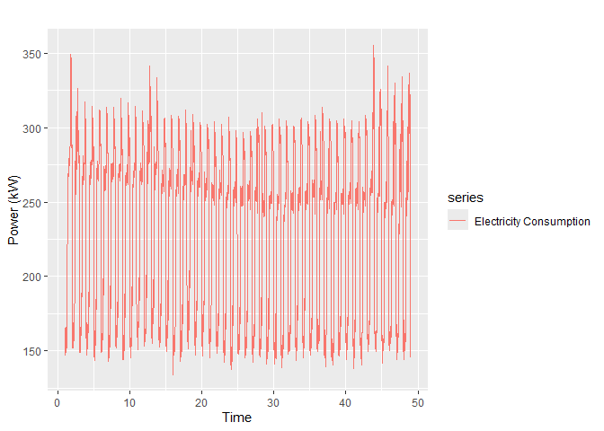<!-- -->

``` r
autoplot(tstemp, series = 'Before the 18th February', ylab = 'Outdoor Temperature (°C)') + 
  autolayer(tstemp_feb18, series = 'After the 18th February')
```

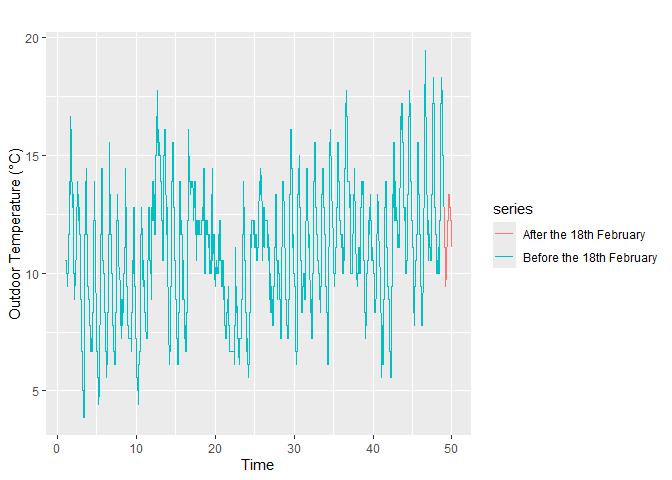<!-- -->

``` r
plot(tstemp, tspower, 
     title = 'Consumption vs Temp', 
     xlab = "Outdoor temperuature",
     ylab = "Power consumption" )
```

    ## Warning in plot.window(...): "title" n'est pas un paramètre graphique

    ## Warning in plot.xy(xy, type, ...): "title" n'est pas un paramètre graphique

    ## Warning in axis(side = side, at = at, labels = labels, ...): "title" n'est pas
    ## un paramètre graphique

    ## Warning in axis(side = side, at = at, labels = labels, ...): "title" n'est pas
    ## un paramètre graphique

    ## Warning in box(...): "title" n'est pas un paramètre graphique

    ## Warning in title(...): "title" n'est pas un paramètre graphique

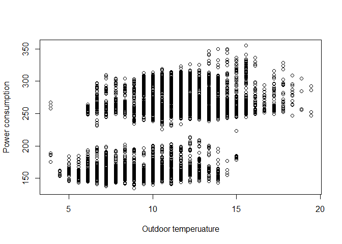<!-- -->

They seem to be a cyclic pattern on the power consumption, which is also
transcribed into the outdoor air temperature. On top of that, we can
notice that :

- The demand in general increases with the temperature

- For temperatures above 15°C, the demand is always high, at the
  opposite of the case when temperatures are below 6°C. Elsewhere, the
  behavior of the consumption is quite the same, switching between high
  and low demands.

Let’s check any trend, seasonality and residuals

``` r
ggseasonplot(tspower,polar=TRUE) + theme(legend.position="none")
```

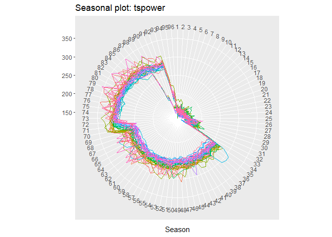<!-- -->

``` r
ggseasonplot(tstemp) + theme(legend.position="none")
```

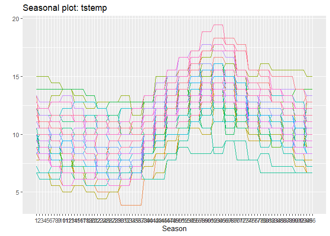<!-- -->

``` r
tspower %>% ggtsdisplay()
```

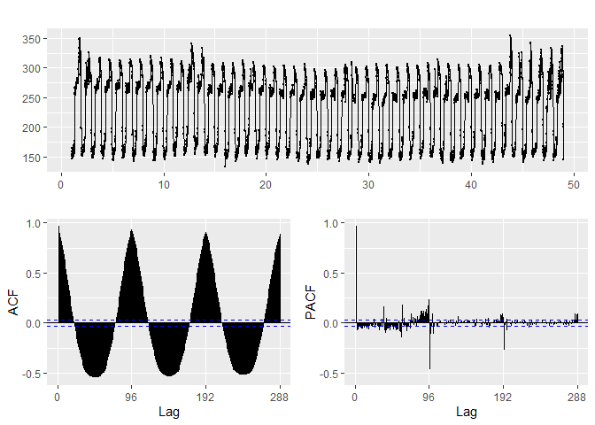<!-- -->

``` r
tstemp %>% ggtsdisplay()
```

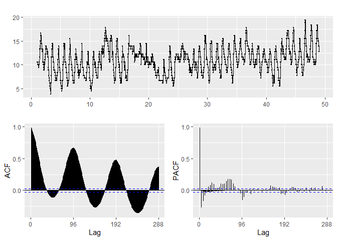<!-- -->

Both ACF are sinusoidal implying a periodic ACF with peaks recurring
every 96 lags. Most of their ACF are out of the bounds of statistical
significance, meaning that there is a significant autocorrelation in
their residuals

**a) On the power consumption :** There is also a slight decrease of the
variance (that can be seen on the residuals with the decrease of their
high peaks and the same value for their low peaks). Reading the ACF
informs that there is no visible linear trend. Plus, a pure seasonal
pattern can be seen and described from the seasonal plot:

- Between 34th period (8h30) and 93th period (23h), the demand is in
  general high, reaching and maintaining its highest value after the
  70th period (17h30), that is, in the evening

- During the night, that is, from the 94th period (23h15) to the 33th
  period (8h15), the demand drops and maintains low.

**b) On the outdoor temperature :** Reading the ACF informs us that
there is a upward and linear trend (each year, the temperature becomes
hotter at this period). Plus, the seasonal plot shows us a pure seasonal
pattern :

- Between the 1st period (00h) and 24th period (6h), the temperature
  decreases to its lowest point

- Between the 25th period (6h15) and 64th period (18h), the temperature
  increases up to its highest point

- From there to the 96th period (23h45), the temperature decreases again

**NB:** It should be noted at first sight , the two time series does not
follow the same seasonal pattern. Plus, the plot between the consumption
and the outdoor temperature shows no specific relationship between the
two. It can be inferred that there is an odd that the use of covariates
will not significantly improve our forecasting. Moreover, the behavior
of the consumption is mostly related to the period of time in the day
(mostly working hours and hours when people are at their homes, back
from their respective work)

# 3. Evaluation of Forecasting models

Before attempting any forecasting, we need to split the data into
training set and test set. The test should span on the same time range
as the forecasting range, that is 96 periods

``` r
tselec_data <- cbind(tspower,tstemp)
colnames(tselec_data) <- c("Power","Temp")

xtrain=head(tselec_data,length(tselec_data[,'Power'])-96)
xtest=tail(tselec_data,96)
```

## 3.1. With Univariate

Let’s first of all instantiate the metrics comparison table

``` r
Metrics <- c('MAPE','AIC','BIC','Parameters count','Runtime (s)')
N = length(Metrics)
perfdf <- data.frame(HW = c(rep(0,N)),
                     AutoAR = c(rep(0,N)),
                     ManualAR = c(rep(0,N)),
                     NNAR = c(rep(0,N)),
                     row.names = Metrics)
```

### 3.1.1. Holt winters

``` r
# Create the model and the fit
start.time <- Sys.time()
modelhw = HoltWinters(xtrain[,1], seasonal = c("additive", "multiplicative"))
fithw = forecast(modelhw,h=96)
end.time <- Sys.time()

# Plot the true and forecasts
autoplot(xtest[,1], ylab ='Power (kW)', series = 'true data') +
  autolayer(fithw$mean,series ='Holt Winters forecasts', PI = FALSE) 
```

    ## Warning in ggplot2::geom_line(ggplot2::aes(x = .data[["timeVal"]], y =
    ## .data[["seriesVal"]], : Ignoring unknown parameters: `PI`

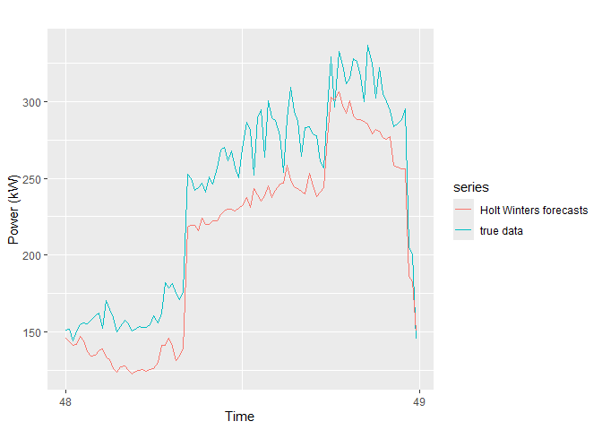<!-- -->

``` r
# Compute and save the metrics
perfdf['MAPE','HW'] <- mean(100*abs((xtest[,1]-fithw$mean)/xtest[,1]))
perfdf['AIC','HW'] <- NA
perfdf['BIC','HW'] <- NA
perfdf['Parameters count','HW'] <- length(modelhw$coef)
perfdf['Runtime (s)','HW'] <- round(as.numeric(difftime(end.time, start.time, units="secs")),2)
```

It shoudl be noted using the *hw()* function instead of the
*HoltWinters()* function will result to an error. In fact, the *hw()*
function need to estimate the initial states of the seasonal components
which are 96 states (implying high frequency due to large period). With
this large number of states, we will surely overfit which is anticipated
by that function.

### 3.1.2. Auto ARIMA

``` r
# Create the model and the fit
start.time <- Sys.time()
modelautoARM = auto.arima(xtrain[,1], lambda = 'auto')
fitautoARM = forecast(modelautoARM,h=96)
end.time <- Sys.time()

# Check its summary & residuals
modelautoARM %>% summary()
```

    ## Series: xtrain[, 1] 
    ## ARIMA(5,0,0)(0,1,0)[96] 
    ## Box Cox transformation: lambda= 0.473688 
    ## 
    ## Coefficients:
    ##          ar1     ar2     ar3      ar4     ar5
    ##       0.7131  0.0858  0.0958  -0.2869  0.1467
    ## s.e.  0.0149  0.0178  0.0178   0.0178  0.0149
    ## 
    ## sigma^2 = 0.3756:  log likelihood = -4097.03
    ## AIC=8206.06   AICc=8206.08   BIC=8244.41
    ## 
    ## Training set error measures:
    ##                       ME     RMSE      MAE        MPE     MAPE      MASE
    ## Training set -0.03518731 10.71748 6.252479 -0.1242666 2.815318 0.7370956
    ##                      ACF1
    ## Training set -0.005843545

``` r
modelautoARM %>% residuals()%>% ggtsdisplay()
```

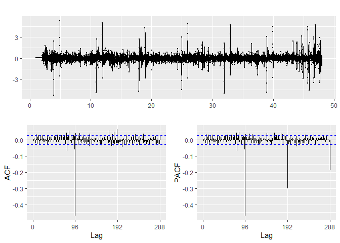<!-- -->

``` r
# Plot the true and forecasts
autoplot(xtest[,1], ylab ='Power (kW)', series = 'true data') +
  autolayer(fitautoARM$mean,series ='Auto ARIMA forecasts', PI = FALSE) 
```

    ## Warning in ggplot2::geom_line(ggplot2::aes(x = .data[["timeVal"]], y =
    ## .data[["seriesVal"]], : Ignoring unknown parameters: `PI`

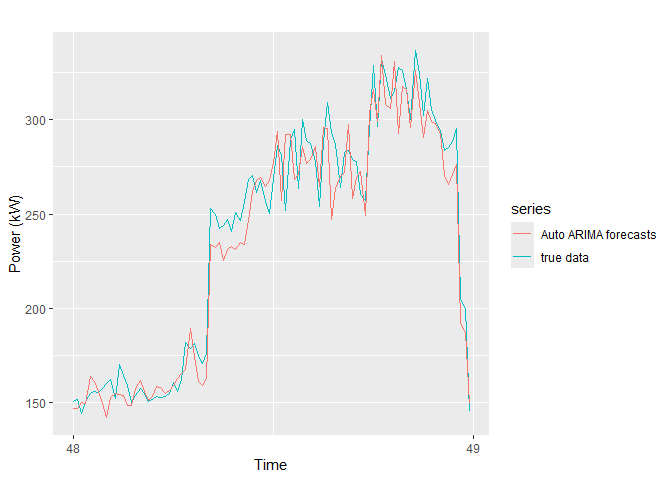<!-- -->

``` r
# Compute and save the metrics
perfdf['MAPE','AutoAR'] <- mean(100*abs((xtest[,1]-fitautoARM$mean)/xtest[,1]))
perfdf['AIC','AutoAR'] <- modelautoARM$aic
perfdf['BIC','AutoAR'] <- modelautoARM$bic
perfdf['Parameters count','AutoAR'] <- length(modelautoARM$coef)
perfdf['Runtime (s)','AutoAR'] <- round(as.numeric(difftime(end.time, start.time, units="secs")),2) 
```

Auto ARIMA with Box Cox transformation seems to work pretty well !
However, there are still some correlated residuals according to the ACF
and PACF. Let’s see if we can manually improve the ARIMA model

### 3.1.3. Manual ARIMA

``` r
lam = BoxCox.lambda(xtrain[,1]) # Find the best lambda
xtrainBC =  BoxCox(xtrain[,1],lam) # Stabilize any potential variance
xtrainBC %>% diff(lag = 96) %>% ggtsdisplay() 
```

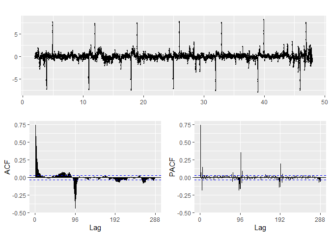<!-- -->

With the seasonality removed, we verify if the residuals is not a white
noise

``` r
Box.test(diff(xtrainBC, lag=96),type="Ljung-Box")
```

    ## 
    ##  Box-Ljung test
    ## 
    ## data:  diff(xtrainBC, lag = 96)
    ## X-squared = 2432.8, df = 1, p-value < 2.2e-16

Thanks to the p-value being less than 5%, we can reject the
null-hypothesis and confirm that the residuals is not a white noise.
Next, we can perform its modelling with the ARIMA method.

From the ACF and PACF graph, we can tune :

- the non-seasonal part as an AR1 model: exponential decrease of the ACF
  and significant PCF at lag 5.

- the seasonal part as an MA1 model: exponential decrease in the
  seasonal lags of the PACF and a significant ACF at lag = 96

``` r
modelmanualARM = Arima(xtrainBC, order=c(5,0,0),seasonal=c(0,1,1))
summary(modelmanualARM)
```

    ## Series: xtrainBC 
    ## ARIMA(5,0,0)(0,1,1)[96] 
    ## 
    ## Coefficients:
    ##          ar1    ar2     ar3      ar4     ar5     sma1
    ##       0.7086  0.094  0.0914  -0.2453  0.1463  -0.8816
    ## s.e.  0.0149  0.018  0.0179   0.0180  0.0149   0.0079
    ## 
    ## sigma^2 = 0.2064:  log likelihood = -2848.42
    ## AIC=5710.83   AICc=5710.86   BIC=5755.58
    ## 
    ## Training set error measures:
    ##                       ME      RMSE       MAE        MPE     MAPE      MASE
    ## Training set -0.01889918 0.4491578 0.2796213 -0.1006302 1.122128 0.5698474
    ##                      ACF1
    ## Training set -0.004409048

``` r
modelmanualARM %>% residuals()%>% ggtsdisplay()
```

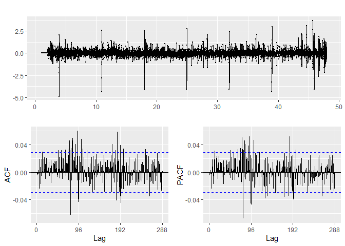<!-- -->

Even though there are still some autocorrelation coefficients left, we
think the tuning is sufficient since those ACF have low absolute values
(\<0.05) and we want to avoid a long runtime and overfitting (due to the
increase of number of parameters). So we can assume that at this stage
of tuning, the residuals are uncorrelated. With the ARIMA model manually
tuned, we can then perform some forecasting on the test set

``` r
# Create the model and the fit
start.time <- Sys.time()
modelmanualARM = Arima(xtrain[,1], lambda = lam, order=c(5,0,0),seasonal=c(0,1,1))
fitmanualARM = forecast(modelmanualARM, h=96)
end.time <- Sys.time()

# Check its summary
modelmanualARM %>% summary()
```

    ## Series: xtrain[, 1] 
    ## ARIMA(5,0,0)(0,1,1)[96] 
    ## Box Cox transformation: lambda= 0.473689 
    ## 
    ## Coefficients:
    ##          ar1    ar2     ar3      ar4     ar5     sma1
    ##       0.7086  0.094  0.0914  -0.2453  0.1463  -0.8816
    ## s.e.  0.0149  0.018  0.0179   0.0180  0.0149   0.0079
    ## 
    ## sigma^2 = 0.2064:  log likelihood = -2848.42
    ## AIC=5710.83   AICc=5710.86   BIC=5755.58
    ## 
    ## Training set error measures:
    ##                     ME     RMSE      MAE       MPE     MAPE      MASE
    ## Training set -0.281597 7.883108 4.860616 -0.225349 2.186616 0.5730109
    ##                     ACF1
    ## Training set -0.02448206

``` r
# Plot the true and forecasts
autoplot(xtest[,1],series='true data') +
 autolayer(fitmanualARM$mean,series='Manual ARIMA forecasts',PI=FALSE)
```

    ## Warning in ggplot2::geom_line(ggplot2::aes(x = .data[["timeVal"]], y =
    ## .data[["seriesVal"]], : Ignoring unknown parameters: `PI`

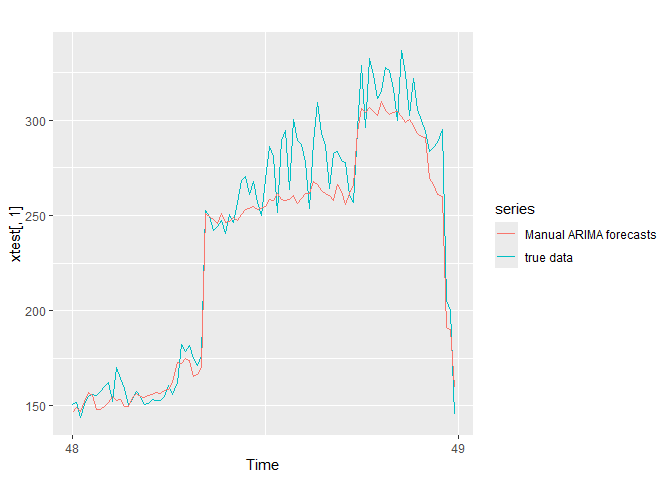<!-- -->

``` r
# Compute and save the metrics
perfdf['MAPE','ManualAR'] <- mean(100*abs((xtest[,1]-fitmanualARM$mean)/xtest[,1]))
perfdf['AIC','ManualAR'] <- modelmanualARM$aic
perfdf['BIC','ManualAR'] <- modelmanualARM$bic
perfdf['Parameters count','ManualAR'] <- length(modelmanualARM$coef)
perfdf['Runtime (s)','ManualAR'] <- round(as.numeric(difftime(end.time, start.time, units="secs")),2) 
```

The MAPE is slightly less than the Auto ARIMA’s one but the trade off
still makes sense since we better the AIC and BIC. Visually, the manual
ARIMA forecast seems to follow well the true data but not that well as
auto ARIMA, especially on the extreme peaks (between 250 and 350 kW)

### 3.1.4. Neural Networks Auto Regression (NNAR)

``` r
# Create the model and the fit
start.time <- Sys.time()
modelNNAR = nnetar(xtrain[,1],lambda = lam)
fitNNAR = forecast(modelNNAR, h=96)
end.time <- Sys.time()

# Check its summary
print(modelNNAR)
```

    ## Series: xtrain[, 1] 
    ## Model:  NNAR(20,1,11)[96] 
    ## Call:   nnetar(y = xtrain[, 1], lambda = lam)
    ## 
    ## Average of 20 networks, each of which is
    ## a 21-11-1 network with 254 weights
    ## options were - linear output units 
    ## 
    ## sigma^2 estimated as 0.2232

``` r
# Plot the true and forecasts
autoplot(xtest[,1],series='true data') +
 autolayer(fitNNAR$mean,series='NNAR forecasts',PI=FALSE)
```

    ## Warning in ggplot2::geom_line(ggplot2::aes(x = .data[["timeVal"]], y =
    ## .data[["seriesVal"]], : Ignoring unknown parameters: `PI`

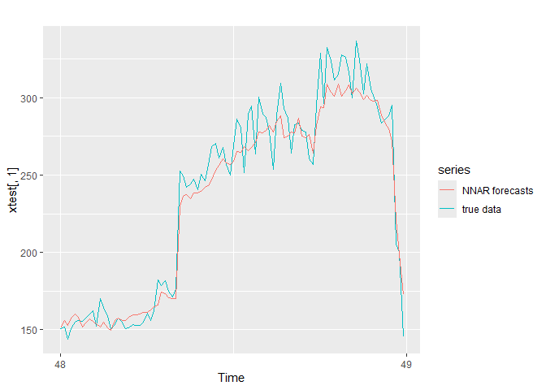<!-- -->

``` r
# Compute and save the metrics
perfdf['MAPE','NNAR'] <- mean(100*abs((xtest[,1]-fitNNAR$mean)/xtest[,1]))
perfdf['AIC','NNAR'] <- NA
perfdf['BIC','NNAR'] <- NA
perfdf['Parameters count','NNAR'] <- length(modelNNAR$model[[1]]$wts)
perfdf['Runtime (s)','NNAR'] <- round(as.numeric(difftime(end.time, start.time, units="secs")),2) 
```

### 3.1.5. Summary

``` r
perfdf
```

    ##                        HW      AutoAR    ManualAR       NNAR
    ## MAPE             12.66444    4.470073    4.725653   4.098085
    ## AIC                    NA 8206.059931 5710.833367         NA
    ## BIC                    NA 8244.411071 5755.576364         NA
    ## Parameters count 98.00000    5.000000    6.000000 254.000000
    ## Runtime (s)       0.36000   95.160000  329.430000  39.360000

The best model (that is, with the best compromise) is the auto ARIMA
model because it is a good trade off in terms of MAPE and runtime, it
has the lowest number of parameters used and it is one that visually
fits well the test set.

Let’s forecast the power consumption on the 18th February

``` r
modelautoARM = auto.arima(tselec_data[,1], lambda = 'auto')
bestfit_univariate = forecast(modelautoARM,h=96)$mean
```

## 3.2. With Covariates

Let’s first of all instantiate the metrics comparison table

``` r
perfdf_multi <- data.frame(DRMAutoARM = c(rep(0,N)),
                           DRMManualARM = c(rep(0,N)),
                           NNAR1 = c(rep(0,N)),
                           row.names = Metrics)
```

### 3.2.1. Dynamic Regression Model - Auto ARIMA

``` r
# Create the model and the fit
start.time <- Sys.time()
modelDRMAutoARM = auto.arima(xtrain[,1],xreg=xtrain[,2],lambda = 'auto')
fitDRMAutoARM = forecast(modelDRMAutoARM,h=96,xreg=xtest[,2])
end.time <- Sys.time()

# Check its summary
modelDRMAutoARM %>% summary()
```

    ## Series: xtrain[, 1] 
    ## Regression with ARIMA(5,0,0)(0,1,0)[96] errors 
    ## Box Cox transformation: lambda= 0.473688 
    ## 
    ## Coefficients:
    ##          ar1     ar2     ar3      ar4     ar5    xreg
    ##       0.7103  0.0867  0.0947  -0.2872  0.1445  0.0343
    ## s.e.  0.0149  0.0178  0.0178   0.0178  0.0149  0.0130
    ## 
    ## sigma^2 = 0.3751:  log likelihood = -4093.74
    ## AIC=8201.49   AICc=8201.51   BIC=8246.23
    ## 
    ## Training set error measures:
    ##                       ME     RMSE      MAE        MPE     MAPE      MASE
    ## Training set -0.03749627 10.71213 6.250876 -0.1258404 2.813896 0.7369067
    ##                      ACF1
    ## Training set -0.005725798

``` r
modelDRMAutoARM %>% residuals()%>% ggtsdisplay()
```

<!-- -->

``` r
checkresiduals(modelDRMAutoARM)
```

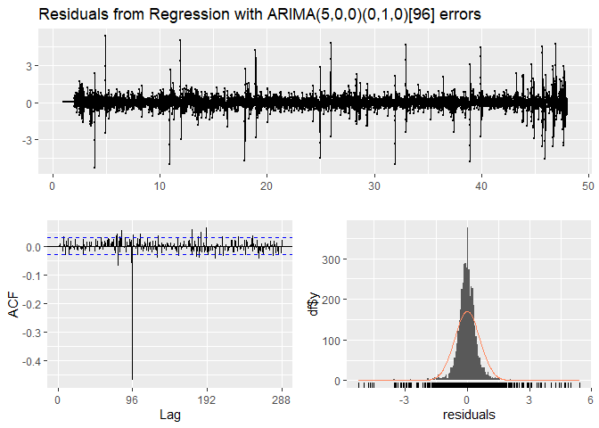<!-- -->

    ## 
    ##  Ljung-Box test
    ## 
    ## data:  Residuals from Regression with ARIMA(5,0,0)(0,1,0)[96] errors
    ## Q* = 1384.5, df = 187, p-value < 2.2e-16
    ## 
    ## Model df: 5.   Total lags used: 192

``` r
# Plot the true and forecasts
autoplot(xtest[,1], ylab ='Power (kW)', series = 'true data') +
  autolayer(fitDRMAutoARM$mean, series ='DRM - Auto ARIMA forecasts', PI = FALSE) 
```

    ## Warning in ggplot2::geom_line(ggplot2::aes(x = .data[["timeVal"]], y =
    ## .data[["seriesVal"]], : Ignoring unknown parameters: `PI`

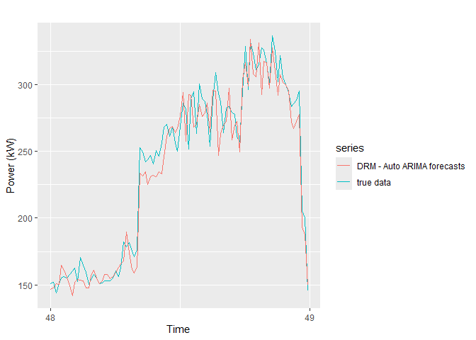<!-- -->

``` r
# Compute and save the metrics
perfdf_multi['MAPE','DRMAutoARM'] <- mean(100*abs((xtest[,1]-fitDRMAutoARM$mean)/xtest[,1]))
perfdf_multi['AIC','DRMAutoARM'] <- modelDRMAutoARM$aic
perfdf_multi['BIC','DRMAutoARM'] <- modelDRMAutoARM$bic
perfdf_multi['Parameters count','DRMAutoARM'] <- length(modelDRMAutoARM$coef)
perfdf_multi['Runtime (s)','DRMAutoARM'] <- round(as.numeric(difftime(end.time, start.time, units="secs")),2) 
```

Similar to its univariate equivalent (auto ARIMA), the forecasts works
well even though there is not that much of an improvement (MAPE : 4.47
vs 4.4). Furthermore, if we check the residuals, there are some
correlated coefficients. Let’s try to improve this

### 3.2.2. Dynamic Regression Model - Auto ARIMA

We start by removing the effect of the trend, the season and the
covariate by using TS Linear Model

``` r
fit1=tslm(Power~Temp+trend+season,data=xtrain)
summary(fit1)
```

    ## 
    ## Call:
    ## tslm(formula = Power ~ Temp + trend + season, data = xtrain)
    ## 
    ## Residuals:
    ##      Min       1Q   Median       3Q      Max 
    ## -114.124   -5.192    0.020    4.932   62.691 
    ## 
    ## Coefficients:
    ##               Estimate Std. Error t value Pr(>|t|)    
    ## (Intercept)  1.529e+02  2.042e+00  74.852  < 2e-16 ***
    ## Temp         1.333e+00  9.565e-02  13.933  < 2e-16 ***
    ## trend       -3.522e-03  1.484e-04 -23.735  < 2e-16 ***
    ## season2     -4.879e-01  2.576e+00  -0.189  0.84981    
    ## season3     -6.173e+00  2.576e+00  -2.396  0.01660 *  
    ## season4     -4.678e-01  2.576e+00  -0.182  0.85592    
    ## season5      2.781e+00  2.576e+00   1.080  0.28036    
    ## season6      2.692e+00  2.563e+00   1.050  0.29366    
    ## season7     -6.401e+00  2.563e+00  -2.498  0.01254 *  
    ## season8     -6.710e+00  2.563e+00  -2.618  0.00887 ** 
    ## season9     -3.615e+00  2.563e+00  -1.411  0.15846    
    ## season10    -3.764e+00  2.563e+00  -1.468  0.14211    
    ## season11    -9.962e-01  2.563e+00  -0.389  0.69756    
    ## season12    -2.029e+00  2.563e+00  -0.792  0.42869    
    ## season13    -5.679e-01  2.563e+00  -0.222  0.82468    
    ## season14    -4.912e+00  2.564e+00  -1.915  0.05550 .  
    ## season15    -6.268e+00  2.564e+00  -2.444  0.01455 *  
    ## season16    -6.579e-01  2.564e+00  -0.257  0.79751    
    ## season17     1.054e+00  2.564e+00   0.411  0.68104    
    ## season18     1.834e-01  2.566e+00   0.071  0.94303    
    ## season19    -8.067e-01  2.566e+00  -0.314  0.75320    
    ## season20     7.819e-01  2.566e+00   0.305  0.76056    
    ## season21     5.471e-01  2.566e+00   0.213  0.83114    
    ## season22     1.487e+00  2.566e+00   0.579  0.56246    
    ## season23     2.220e+00  2.566e+00   0.865  0.38710    
    ## season24     4.228e+00  2.566e+00   1.647  0.09956 .  
    ## season25     3.827e+00  2.566e+00   1.491  0.13599    
    ## season26     7.299e+00  2.566e+00   2.844  0.00447 ** 
    ## season27     1.481e+01  2.566e+00   5.771 8.41e-09 ***
    ## season28     1.614e+01  2.566e+00   6.288 3.52e-10 ***
    ## season29     1.683e+01  2.566e+00   6.559 6.04e-11 ***
    ## season30     2.144e+01  2.566e+00   8.355  < 2e-16 ***
    ## season31     1.999e+01  2.566e+00   7.789 8.34e-15 ***
    ## season32     1.560e+01  2.566e+00   6.077 1.33e-09 ***
    ## season33     1.931e+01  2.566e+00   7.523 6.47e-14 ***
    ## season34     1.028e+02  2.566e+00  40.060  < 2e-16 ***
    ## season35     1.006e+02  2.566e+00  39.214  < 2e-16 ***
    ## season36     9.812e+01  2.566e+00  38.247  < 2e-16 ***
    ## season37     9.737e+01  2.566e+00  37.951  < 2e-16 ***
    ## season38     1.004e+02  2.562e+00  39.176  < 2e-16 ***
    ## season39     9.518e+01  2.562e+00  37.149  < 2e-16 ***
    ## season40     9.725e+01  2.562e+00  37.954  < 2e-16 ***
    ## season41     9.821e+01  2.562e+00  38.330  < 2e-16 ***
    ## season42     9.447e+01  2.563e+00  36.856  < 2e-16 ***
    ## season43     9.563e+01  2.563e+00  37.309  < 2e-16 ***
    ## season44     9.730e+01  2.563e+00  37.959  < 2e-16 ***
    ## season45     9.778e+01  2.563e+00  38.147  < 2e-16 ***
    ## season46     9.935e+01  2.568e+00  38.689  < 2e-16 ***
    ## season47     9.742e+01  2.568e+00  37.935  < 2e-16 ***
    ## season48     9.815e+01  2.568e+00  38.222  < 2e-16 ***
    ## season49     9.898e+01  2.568e+00  38.542  < 2e-16 ***
    ## season50     9.885e+01  2.575e+00  38.385  < 2e-16 ***
    ## season51     1.014e+02  2.575e+00  39.358  < 2e-16 ***
    ## season52     1.011e+02  2.575e+00  39.247  < 2e-16 ***
    ## season53     9.950e+01  2.575e+00  38.636  < 2e-16 ***
    ## season54     1.004e+02  2.581e+00  38.884  < 2e-16 ***
    ## season55     1.007e+02  2.581e+00  39.004  < 2e-16 ***
    ## season56     1.007e+02  2.581e+00  39.012  < 2e-16 ***
    ## season57     9.924e+01  2.581e+00  38.453  < 2e-16 ***
    ## season58     9.946e+01  2.588e+00  38.438  < 2e-16 ***
    ## season59     1.002e+02  2.588e+00  38.723  < 2e-16 ***
    ## season60     1.000e+02  2.588e+00  38.647  < 2e-16 ***
    ## season61     1.013e+02  2.588e+00  39.164  < 2e-16 ***
    ## season62     1.010e+02  2.590e+00  38.984  < 2e-16 ***
    ## season63     9.995e+01  2.590e+00  38.587  < 2e-16 ***
    ## season64     9.937e+01  2.590e+00  38.365  < 2e-16 ***
    ## season65     9.940e+01  2.590e+00  38.377  < 2e-16 ***
    ## season66     9.903e+01  2.584e+00  38.318  < 2e-16 ***
    ## season67     1.013e+02  2.584e+00  39.203  < 2e-16 ***
    ## season68     9.863e+01  2.584e+00  38.163  < 2e-16 ***
    ## season69     9.710e+01  2.584e+00  37.572  < 2e-16 ***
    ## season70     1.164e+02  2.575e+00  45.185  < 2e-16 ***
    ## season71     1.282e+02  2.575e+00  49.777  < 2e-16 ***
    ## season72     1.415e+02  2.575e+00  54.962  < 2e-16 ***
    ## season73     1.439e+02  2.575e+00  55.876  < 2e-16 ***
    ## season74     1.419e+02  2.568e+00  55.273  < 2e-16 ***
    ## season75     1.415e+02  2.568e+00  55.115  < 2e-16 ***
    ## season76     1.405e+02  2.568e+00  54.726  < 2e-16 ***
    ## season77     1.403e+02  2.568e+00  54.620  < 2e-16 ***
    ## season78     1.466e+02  2.566e+00  57.134  < 2e-16 ***
    ## season79     1.429e+02  2.566e+00  55.675  < 2e-16 ***
    ## season80     1.408e+02  2.566e+00  54.876  < 2e-16 ***
    ## season81     1.399e+02  2.566e+00  54.511  < 2e-16 ***
    ## season82     1.408e+02  2.564e+00  54.905  < 2e-16 ***
    ## season83     1.381e+02  2.564e+00  53.839  < 2e-16 ***
    ## season84     1.373e+02  2.564e+00  53.545  < 2e-16 ***
    ## season85     1.371e+02  2.564e+00  53.456  < 2e-16 ***
    ## season86     1.350e+02  2.563e+00  52.693  < 2e-16 ***
    ## season87     1.332e+02  2.563e+00  51.970  < 2e-16 ***
    ## season88     1.319e+02  2.563e+00  51.458  < 2e-16 ***
    ## season89     1.301e+02  2.563e+00  50.779  < 2e-16 ***
    ## season90     1.129e+02  2.562e+00  44.055  < 2e-16 ***
    ## season91     1.110e+02  2.562e+00  43.319  < 2e-16 ***
    ## season92     1.055e+02  2.562e+00  41.183  < 2e-16 ***
    ## season93     1.060e+02  2.562e+00  41.385  < 2e-16 ***
    ## season94     3.097e+01  2.562e+00  12.086  < 2e-16 ***
    ## season95     3.243e+01  2.562e+00  12.659  < 2e-16 ***
    ## season96     2.904e+00  2.562e+00   1.134  0.25705    
    ## ---
    ## Signif. codes:  0 '***' 0.001 '**' 0.01 '*' 0.05 '.' 0.1 ' ' 1
    ## 
    ## Residual standard error: 12.35 on 4409 degrees of freedom
    ## Multiple R-squared:  0.9549, Adjusted R-squared:  0.9539 
    ## F-statistic: 962.9 on 97 and 4409 DF,  p-value: < 2.2e-16

``` r
CV(fit1)
```

    ##           CV          AIC         AICc          BIC        AdjR2 
    ## 1.559965e+02 2.275943e+04 2.276392e+04 2.339436e+04 9.539322e-01

the R-squared and its adjusted seems pretty good. All the features seem
significant. However, the correlation coefficient for the trend is close
to 0 even if its associated p-value is relevant. We can note seasonal
terms after the 26th one are the only relevant based on their p-value.
Let’s check for the residuals

``` r
checkresiduals(fit1)
```

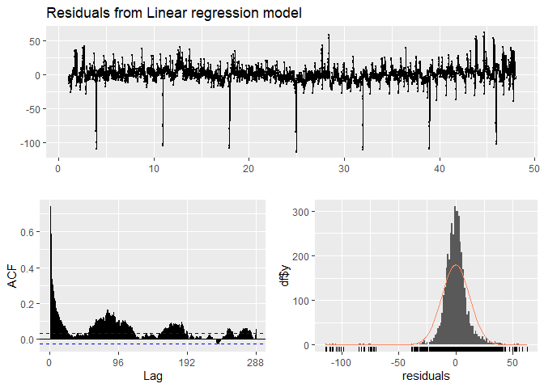<!-- -->

    ## 
    ##  Breusch-Godfrey test for serial correlation of order up to 192
    ## 
    ## data:  Residuals from Linear regression model
    ## LM test = 2725, df = 192, p-value < 2.2e-16

``` r
fit1$residuals %>% ggtsdisplay()
```

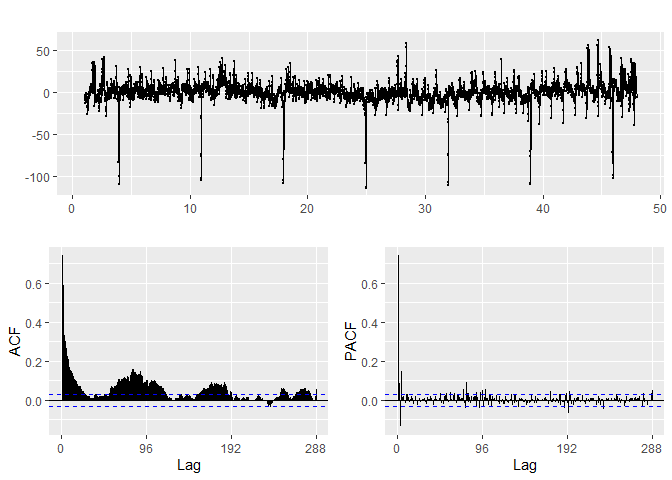<!-- -->

We can see that there is an exponential decrease of the ACF and an
important PAC at lag = 5. Maybe AR5 will model this residuals

``` r
tmp=fit1$residuals
fit2=Arima(tmp,order=c(5,0,0))
checkresiduals(fit2)
```

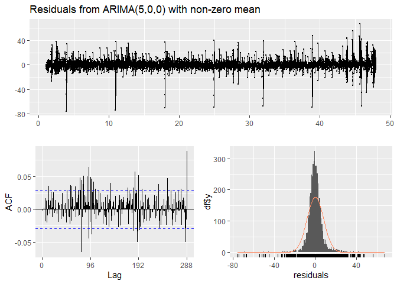<!-- -->

    ## 
    ##  Ljung-Box test
    ## 
    ## data:  Residuals from ARIMA(5,0,0) with non-zero mean
    ## Q* = 396.77, df = 187, p-value < 2.2e-16
    ## 
    ## Model df: 5.   Total lags used: 192

Even though there are some terms that are out of the bounds of
statistical significance, their values are really low. Furthermore,
adding more coefficients will just increase the chance of overfitting.
So we can consider at this stage of tuning that the corresponding
residuals are uncorrelated.

In conclusion, We can propose an SARIMA model with non seasonal part
equal to c(5,0,0) and seasonal part equal to c(0,1,0) (to take into
account season & trend):

``` r
fit=Arima(xtrain[,"Power"],xreg=xtrain[,"Temp"],order=c(5,0,0),seasonal = c(0,1,0))
fit$residuals %>% ggtsdisplay()
```

<!-- -->

We set now the seasonal part to c(0,1,1) to take into account the
exponential decrease on the seasonal lags (96, 192, 288) on PACF and the
spike at lag = 96 on the ACF

``` r
fit=Arima(xtrain[,"Power"],xreg=xtrain[,"Temp"],order=c(5,0,0),seasonal = c(0,1,1))
fit$residuals %>% ggtsdisplay()
```

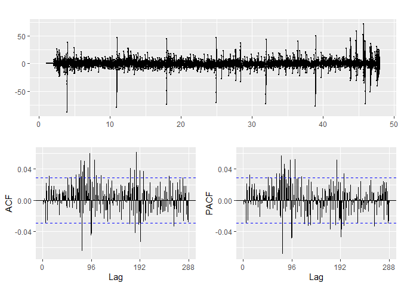<!-- -->

As seen earlier, the tuning is enough as we wish to avoid overfitting
and long runtime. Now we can perform forecast and compute metrics

``` r
# Create the model and the fit
start.time <- Sys.time()
modelDRMManualARM = Arima(xtrain[,"Power"],xreg=xtrain[,"Temp"],order=c(5,0,0),seasonal = c(0,1,1), lambda = lam)
fitDRMManualARM = forecast(modelDRMManualARM, h=96,xreg=xtest[,2])
end.time <- Sys.time()
 
# Plot the true and forecasts
autoplot(xtest[,1],series='true data') +
 autolayer(fitDRMManualARM$mean,series='DRM - Manual ARIMA forecasts',PI=FALSE)
```

    ## Warning in ggplot2::geom_line(ggplot2::aes(x = .data[["timeVal"]], y =
    ## .data[["seriesVal"]], : Ignoring unknown parameters: `PI`

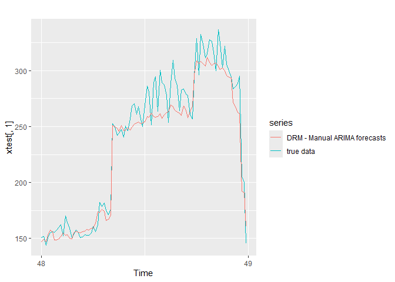<!-- -->

``` r
# Compute and save the metrics
perfdf_multi['MAPE','DRMManualARM'] <- mean(100*abs((xtest[,1]-fitDRMManualARM$mean)/xtest[,1]))
perfdf_multi['AIC','DRMManualARM'] <- modelDRMManualARM$aic
perfdf_multi['BIC','DRMManualARM'] <- modelDRMManualARM$bic
perfdf_multi['Parameters count','DRMManualARM'] <- length(modelDRMManualARM$coef)
perfdf_multi['Runtime (s)','DRMManualARM'] <- round(as.numeric(difftime(end.time, start.time, units="secs")),2) 
```

### 3.2.3. Neural Networks AutoRegression

``` r
# Create the model and the fit
start.time <- Sys.time()
modelNNAR1 = nnetar(xtrain[,1],xreg=xtrain[,2],lambda = lam)
fitNNAR1 = forecast(modelNNAR1, h=96,xreg=xtest[,2])
end.time <- Sys.time()

# Check its summary
print(modelNNAR1)
```

    ## Series: xtrain[, 1] 
    ## Model:  NNAR(20,1,12)[96] 
    ## Call:   nnetar(y = xtrain[, 1], xreg = xtrain[, 2], lambda = lam)
    ## 
    ## Average of 20 networks, each of which is
    ## a 22-12-1 network with 289 weights
    ## options were - linear output units 
    ## 
    ## sigma^2 estimated as 0.2222

``` r
# Plot the true and forecasts
autoplot(xtest[,1],series='true data') +
 autolayer(fitNNAR1$mean,series='NNAR forecasts',PI=FALSE)
```

    ## Warning in ggplot2::geom_line(ggplot2::aes(x = .data[["timeVal"]], y =
    ## .data[["seriesVal"]], : Ignoring unknown parameters: `PI`

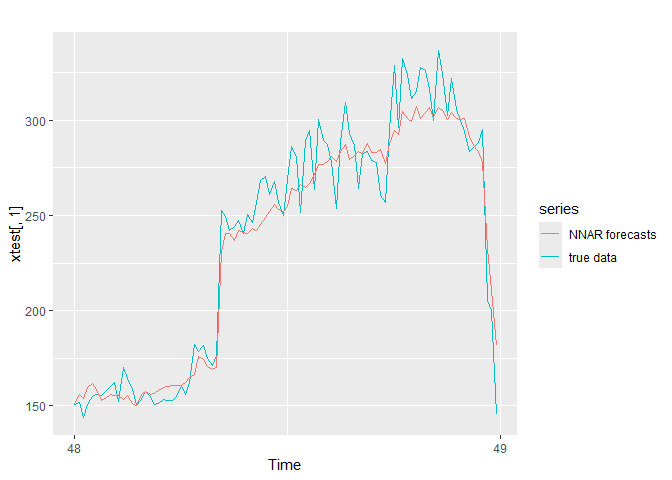<!-- -->

``` r
# Compute and save the metrics
perfdf_multi['MAPE','NNAR1'] <- mean(100*abs((xtest[,1]-fitNNAR1$mean)/xtest[,1]))
perfdf_multi['AIC','NNAR1'] <- NA
perfdf_multi['BIC','NNAR1'] <- NA
perfdf_multi['Parameters count','NNAR1'] <- length(modelNNAR1$model[[1]]$wts)
perfdf_multi['Runtime (s)','NNAR1'] <- round(as.numeric(difftime(end.time, start.time, units="secs")),2) 
```

### 3.2.4. Summary

``` r
perfdf_multi
```

    ##                   DRMAutoARM DRMManualARM      NNAR1
    ## MAPE                4.404176     4.557704   4.344176
    ## AIC              8201.489365  5704.410526         NA
    ## BIC              8246.232362  5755.545380         NA
    ## Parameters count    6.000000     7.000000 289.000000
    ## Runtime (s)       130.420000   578.760000  43.820000

In terms of AIC/BIC, the DRM - Manual ARM seems the best model. However,
we think the best model should be a good compromise with other
parameters. That’s why we choose the auto ARIMA model. Precisely, it is
a good trade off in terms of MAPE, parameters count and runtime. Plus,it
is the best that visually fits the test set.

``` r
modelDRMAutoARM = auto.arima(tselec_data[,1],xreg=tselec_data[,2],lambda = 'auto')
bestfit_covariate = forecast(modelDRMAutoARM, h=96, xreg = tstemp_feb18)$mean
```

    ## Warning in forecast.forecast_ARIMA(modelDRMAutoARM, h = 96, xreg =
    ## tstemp_feb18): xreg contains different column names from the xreg used in
    ## training. Please check that the regressors are in the same order.

# 4. Conclusions & Discussions 
Let’s store the best fits in an excel
file

``` r
# Create the bestfit vector
bestfit = cbind(bestfit_univariate, bestfit_covariate)
colnames(bestfit) = cbind('forecast with univariate','forecast with covariate')

# Create a convenient file name yyyy_MM_dd_hh_mm_ss in order to be unique at each simulation
outputfilename = Sys.time() 

outputfilename <- outputfilename %>% {gsub('[\t\n]', '',.)} %>% {gsub('[ :-]', '_',.)} 

outputfilename <- paste(outputfilename,'.xlsx',sep="")

# Save the results in an Excel File
write.xlsx(bestfit,outputfilename, sheetName = "Sheet1", col.names = TRUE, append = TRUE)
```

Let’s compare models with univariate and models with covariate

``` r
autoplot(bestfit)
```

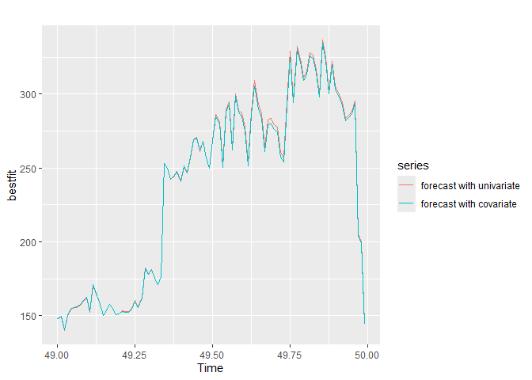<!-- -->

``` r
cbind(perfdf,perfdf_multi)
```

    ##                        HW      AutoAR    ManualAR       NNAR  DRMAutoARM
    ## MAPE             12.66444    4.470073    4.725653   4.098085    4.404176
    ## AIC                    NA 8206.059931 5710.833367         NA 8201.489365
    ## BIC                    NA 8244.411071 5755.576364         NA 8246.232362
    ## Parameters count 98.00000    5.000000    6.000000 254.000000    6.000000
    ## Runtime (s)       0.36000   95.160000  329.430000  39.360000  130.420000
    ##                  DRMManualARM      NNAR1
    ## MAPE                 4.557704   4.344176
    ## AIC               5704.410526         NA
    ## BIC               5755.545380         NA
    ## Parameters count     7.000000 289.000000
    ## Runtime (s)        578.760000  43.820000

Performance-wise, using covariates doesn’t help the forecasting
techniques that much. This was anticipated during the EDA. For some
models like NNAR, it worsens it (MAPE, runtime and number of parameters
increase).
